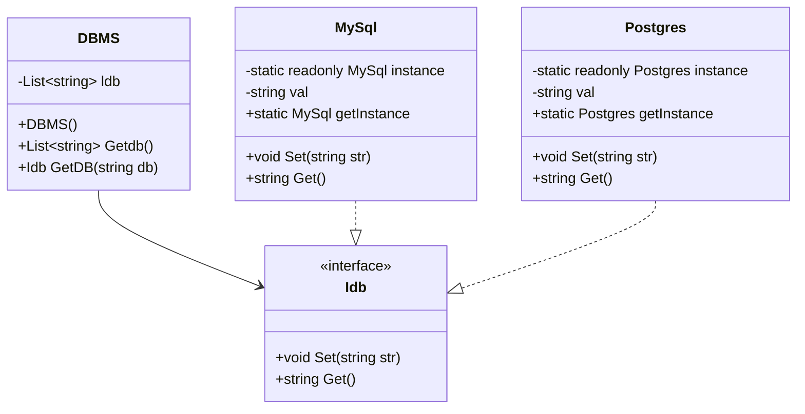

```mermaid
classDiagram
    class DBMS {
        -List~string~ ldb
        +DBMS()
        +List~string~ Getdb()
        +Idb GetDB(string db)
    }

    class Idb {
        <<interface>>
        +void Set(string str)
        +string Get()
    }

    class MySql {
        -static readonly MySql instance
        -string val
        +static MySql getInstance
        +void Set(string str)
        +string Get()
    }

    class Postgres {
        -static readonly Postgres instance
        -string val
        +static Postgres getInstance
        +void Set(string str)
        +string Get()
    }

    DBMS --> Idb
    MySql ..|> Idb
    Postgres ..|> Idb
```