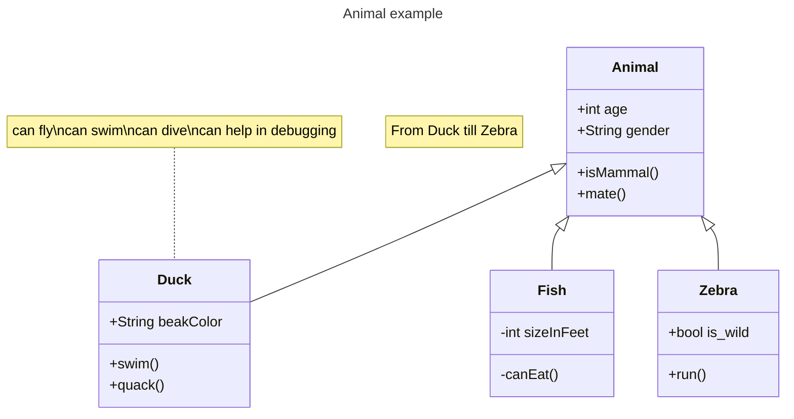

---
@startuml
left to right direction
actor "Food Critic" as fc
rectangle Restaurant {
usecase "Eat Food" as UC1
usecase "Pay for Food" as UC2
usecase "Drink" as UC3
}
fc --> UC1
fc --> UC2
fc --> UC3
@enduml
---

