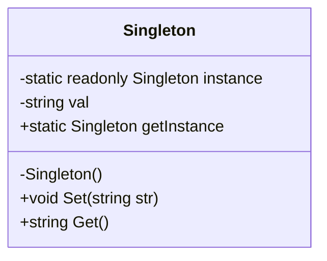

```mermaid
classDiagram
    class Singleton {
        -static readonly Singleton instance
        -string val
        -Singleton()
        +static Singleton getInstance
        +void Set(string str)
        +string Get()
    }
```